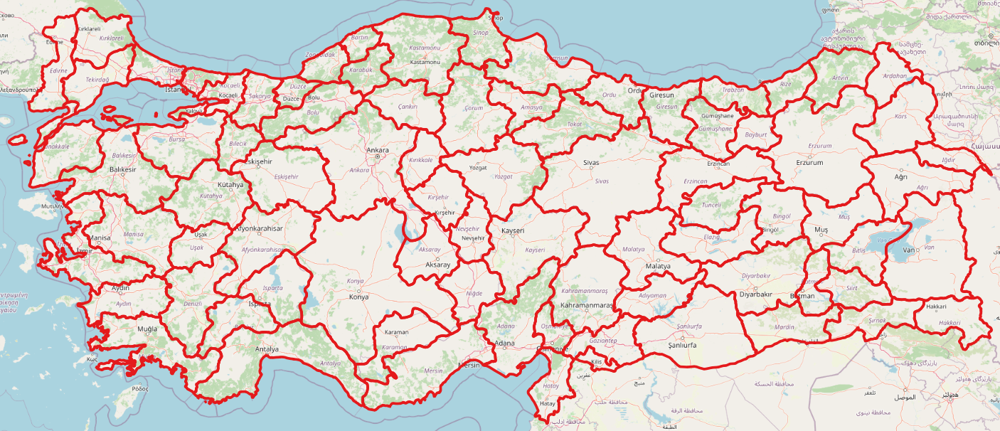
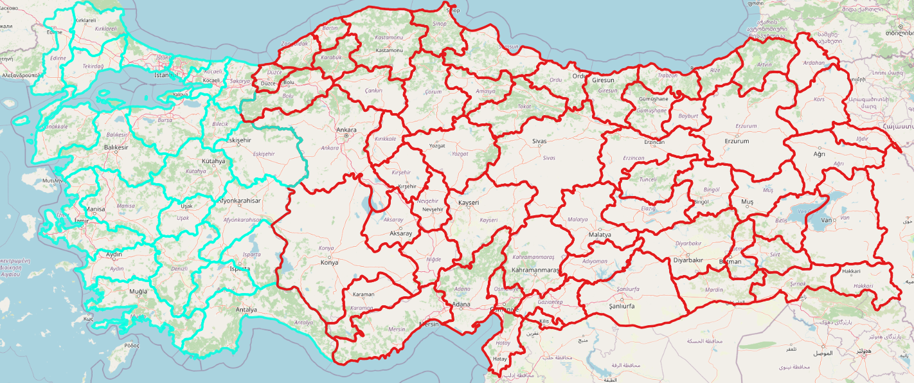
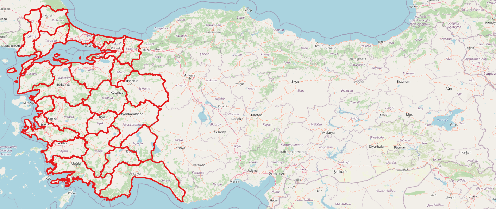

# QGIS Create Layer From Selected Features Plugin

This plugin creates a layer using selected features. A filtering operation is performed to selected layer, new files(.shp, kml, gml etc.) are not created.

An illustrative example is shown below:
 

  

  

  

 

### For creating a layer from selected features:
<b>1-)</b> Select the features to be used for creating new layer, 
<b>2-)</b> Select the layer from "Layers Panel", 
<b>3-)</b> Press the icon

